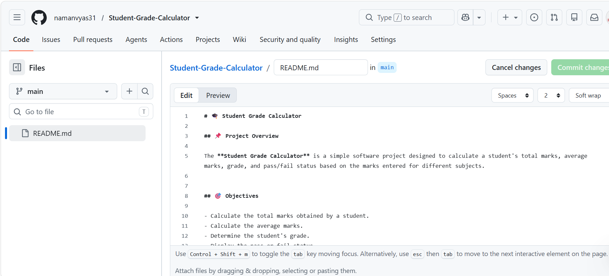
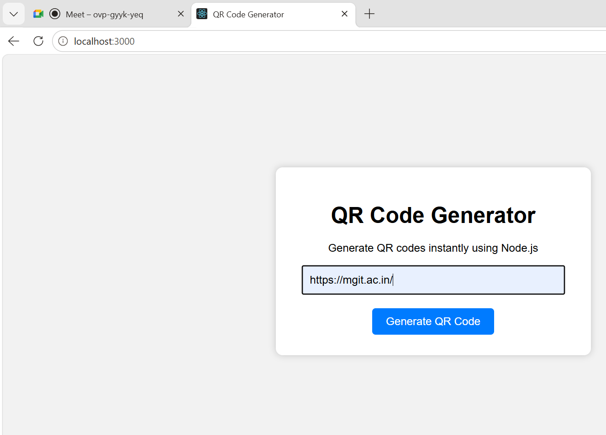

# 🎓 Student Grade Calculator

## 📌 Project Overview

The **Student Grade Calculator** is a simple software project designed to calculate a student's total marks, average marks, grade, and pass/fail status based on the marks entered for different subjects.


## 🎯 Objectives

- Calculate the total marks obtained by a student.
- Calculate the average marks.
- Determine the student's grade.
- Display the pass or fail status.
- Provide a simple and easy-to-use system for grade calculation.

## ✨ Features

- Enter marks for multiple subjects.
- Calculate total marks automatically.
- Calculate average marks.
- Assign grades based on marks.
- Display pass or fail status.
- Simple and user-friendly interface.


## 🛠️ Technologies Used

| Technology | Purpose |
|------------|---------|
| Python | Application logic |
| HTML | Page structure |
| CSS | Page styling |


## 📁 Folder Structure

```text
Student-Grade-Calculator/
│
├── app.py
├── README.md
├── requirements.txt
└── screenshots/
    ├── home.png
    └── result.png
```


## ⚙️ Installation

1. Install **Python** on your system.
2. Clone the repository:

```bash
git clone https://github.com/namanvyas31/Student-Grade-Calculator.git
```

3. Open the project folder:

```bash
cd Student-Grade-Calculator
```

4. Install the required dependencies:

```bash
pip install -r requirements.txt
```

5. Run the application:

```bash
python app.py
```

## 🖼️ Screenshots

### Home Page



### Result Page



---

## 💻 Sample Code

The following Python code demonstrates the basic grade calculation logic:

```python
marks = [85, 78, 92, 88, 75]

total = sum(marks)
average = total / len(marks)

if average >= 90:
    grade = "A+"
elif average >= 80:
    grade = "A"
elif average >= 70:
    grade = "B"
elif average >= 60:
    grade = "C"
else:
    grade = "F"

print("Total Marks:", total)
print("Average:", average)
print("Grade:", grade)
```

The application can be executed using the `python app.py` command.

---

## 🔗 Useful Links

- [Python Official Website](https://www.python.org/)
- [GitHub Repository](https://github.com/)
- [Markdown Guide](https://www.markdownguide.org/)

---

<!-- This section demonstrates the use of a Markdown comment. -->

## 🚀 Future Scope

- Add a graphical user interface.
- Store student records in a database.
- Add login and authentication.
- Generate downloadable result reports.
- Add support for multiple students.
- Develop a web-based version of the application.

---

## 📌 Project Status


> "Learning by building is the best way to improve programming skills." 💡

---

## 😊 Conclusion

The Student Grade Calculator demonstrates how programming can be used to automate basic academic calculations. The project provides a simple way to calculate marks, averages, grades, and results.
